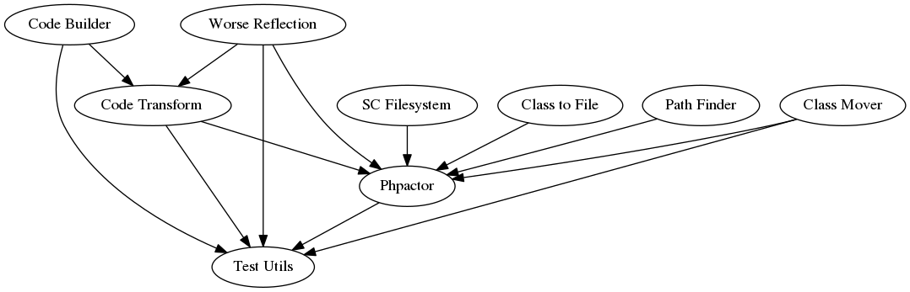

About Phpactor
==============

Phpactor is an intelligent code-completion and refactoring tool for PHP.

- **Code Completion**: Provides broad and accurate context aware code completion.
- **No indexing**: Phpactor works in real-time and is optimized with
  [composer](https://getcomposer.org). It is fast.
- **Introspection**: Jump to class and method definitions, find references.
- **Refactoring**: Move classes, complete constructors, implement contracts,
  generate methods, etc.
- **Native VIM plugin**: Lightweight VIM plugin.
- **CLI interface**: Most/some functionality is exposed through CLI commands.

Phpactor can be used in a limited way as a **standalone application**, but its full
power can only be utilized through its RPC protocol. It ships with support for
VIM and there is also a plugin for
[Emacs](https://github.com/emacs-php/phpactor.el).

Phpactor is pronounced "factor", as in "factorisation" and "re-factoring". It
is a large project and some parts are more fully realised than others but it
is used as an essential tool in day-to-day PHP work.

Packages
--------

Phpactor is made up of a few different packages:

- [phpactor/class-mover](https://github.com/phpactor/class-mover): Find and update class references.
- [phpactor/class-to-file](https://github.com/phpactor/class-to-file): Convert files to class names and vice-versa.
- [phpactor/code-builder](https://github.com/phpactor/code-builder): Library for creating and idempotently updating source code.
- [phpactor/code-transform](https://github.com/phpactor/code-transform): Transform code.
- [phpactor/completion](https://github.com/phpactor/completion): Completion library.
- [phpactor/path-finder](https://github.com/phpactor/path-finder): Simple for file relationships when they share common path segments.
- [phpactor/source-code-filesystem](https://github.com/phpactor/source-code-filesystem): Manage source code trees.
- [phpactor/test-utils](https://github.com/phpactor/test-utils): Shared test utilities for Phpactor
- [phpactor/worse-reflection](https://github.com/phpactor/worse-reflection): Static source reflection library.

Depends On
----------

Phpactor stands on the shoulders of some other packages:

- [Couscous](http://couscous.io/): This documentation is generated with Couscous.
- [Jetbrains PhpStorm Stubs](https://github.com/JetBrains/phpstorm-stubs): Built in PHP classes are supported through this stub collection from PhpStorm.
- [PHPBench](https://github.com/phpbench/phpbench): For tracking performance.
- [PHPUnit](https://github.com/sebastianbergmann/phpunit): The de facto
  standard PHP test framework
- [Symfony](https://symfony.com): The command line application is built with the Symfony console component.
- [Tolerant PHP Parser](https://github.com/Microsoft/tolerant-php-parser): Large parts of Phpactor are integrated with the TPP.

Influenced By
-------------

- [BetterReflection](https://github.com/Roave/BetterReflection): Phpactors reflection API was heavily influenced by this library.
- [Language Server Protocol](https://github.com/Microsoft/language-server-protocol): While not implementing the LSP, some terminology has been borrowed from it.
- [Nikic PHP Parser](https://github.com/nikic/PHP-Parser): The original Phpactor used this before switching to TPP.

Similar Projects
----------------

- [PHP Language Server](https://github.com/felixfbecker/php-language-server): An LSP implementation for PHP.
