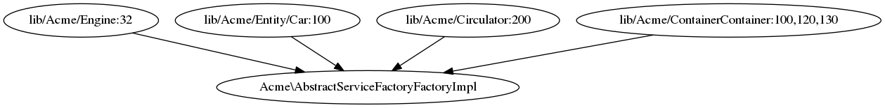

.. _navigation:

Navigation
==========

Phpactor provides some functionality for navigating to (and generating)
contextually relevant files such as parent classes, definitions, unit
tests, references etc.

.. contents::
   :depth: 1
   :backlinks: none
   :local:

.. _navigation_class_references:

Class References
----------------

Navigate / list all references to a given class.

.. tabs::

   .. tab:: CLI

       .. code-block:: sh

           $ phpactor references:class path/to/Class.php

   .. tab:: VIM Context Menu

       *Class context menu > Find references*.

   .. tab:: VIM Plugin

       .. code:: sh

           :PhpactorFindReferences

   .. tab:: LSP

       Supported via. the `textDocument/references` action.

Description
~~~~~~~~~~~

Keep track of where a class is being used or perform an initial survey
before deciding to rename a class.

The VIM plugin will load the class references into a quick fix list
which you can navigate through (see ``:help quickfix``).

The CLI command will list the references and show a highlighted line
where the references were found.

   Class references

.. _navigation_class_member_references:

Class Member References
-----------------------

Navigate / list all references to a given class member (method, property
or constant).

.. tabs::

   .. tab:: CLI

       .. code-block:: sh

           $ phpactor references:member path/to/Class.php memberName

   .. tab:: VIM Context Menu

       *Member context menu > Find references*.

   .. tab:: VIM Plugin

       .. code-block::

           :PhpactorFindReferences

   .. tab:: Language Server

       Supported via. the `textDocument/references` action.

.. _description-1:

Description
~~~~~~~~~~~

Scan for all references to a class member in the project.

This functionality is very similar to `Class
References <#class-references>`__ with the exception that it is possible
that not all members will be found as PHP is a loosely typed language
and it may not be possible to determine all the class types of methods
matching the query.

Hover
-----

While not a navigation function as such, this RPC command will show
brief information about the symbol underneath the cursor.

.. tabs::

   .. tab:: VIM Context Menu

       *Context menu* > Hover_.

   .. tab:: VIM Plugin

       .. code-block::

           :PhpactorHover

   .. tab:: LSP

       Supported via. the `textDocument/hover` action.

Jump to definition
------------------

Jump to the definition of a class or class member.

.. tabs::

   .. tab:: VIM Context Menu

       *Member/class context menu > Goto definition*.

   .. tab:: VIM Plugin

       .. code-block::

           :PhpactorGotoDefinition

   .. tab:: LSP

       Supported via. the `textDocument/definition` action.

.. _description-2:

Description
~~~~~~~~~~~

Open the file containing the class or class member under the cursor and
move the cursor to the place where class or class member is defined.

This feature is **extremely useful**! Be sure to map it to a keyboard
shortcut and use it often to quickly navigate through your source code.

Jump to type
------------

Jump to the type of the symbol under the cursor.

.. tabs::

   .. tab:: VIM Context Menu

       \_Member/class context menu > Goto type.

   .. tab:: VIM Plugin

       .. code-block::

           :PhpactorGotoType()

   .. tab:: LSP

       Supported via. the `textDocument/typeDefinition` action.

.. _description-3:

Description
~~~~~~~~~~~

Sometimes you will want to jump to the type (i.e. the class) of a
symbol, for example if you reference a property in code,
``$this->locator``, you can invoke *goto type* on the property and jump
to the, for example, ``Locator`` type.

.. _navigation_goto_implementation:

Jump to Implementation
----------------------

Jump to the implementation(s) of an interface or class

.. tabs::

   .. tab:: VIM Context Menu

       *Member/class context menu > Goto implementation*.

   .. tab:: VIM Plugin

       .. code-block::

           :PhpactorGotoImplementations

   .. tab:: LSP

       Supported via. the `textDocument/implementation` action.

Jump to implementations of the interface or class under the cursor.

Note that this feature only works when used with the :ref:`indexer`.

Jump to or generate related file
--------------------------------

Jump to a related file (e.g. parent class, interfaces, unit test,
integration test, benchmark), and optionally generate it if it doesn't
exist (where supported).

Jumping
~~~~~~~

.. tabs::

   .. tab:: VIM Context Menu

       *Class context menu > Navigate*.

   .. tab:: VIM Plugin

       .. code-block::

           :PhpactorNavigate

You specify the jump patterns in ``.phpactor.json`` with :ref:`param_navigator.destinations`:

::

    {
        "navigator.destinations":
        {
          "source": "lib/<kernel>.php",
          "unit_test": "tests/Unit/<kernel>Test.php"
        }
    }

This would enable you to jump from
 ``lib/Acme/Post.php`` to ``tests/Unit/Acme/Post.php`` and vice-versa.

Generating
~~~~~~~~~~

If the file doesn't exist you automatically create it by mapping the
navigation targets to template :ref:`variants <template_variants>`:

::

    {
        "code_transform.class_new.variants":
        {
            "source": "default",
            "unit_test": "phpunit_test",
            "exception": "exception",
            "symfony_command": "symfony_command"
        }
    }

Now Phpactor should prompt you to create the navigation target if it doesn't exist.

.. _description-4:

Description
~~~~~~~~~~~

Often classes will have a one-to-one relationship with another class,
for example a single class will often have a matching unit test.

Phpactor provides a way to define this relationship:

.. code:: yaml

   # .phpactor.yml
   navigator.destinations:
       source: lib/<kernel>.php
       unit_test: tests/Unit/<kernel>Test.php

   navigator.autocreate:
       source: default
       unit_test: phpunit_test

Above we define a pattern which will match the source code of the
project (and assign it an identifier ``source``). We also identify a
pattern to identify ``unit_test`` classes.

When you are in a ``source`` file, the navigate option will offer you
the possibility of jumping to the unit test, and vice-versa.

Above we additionally (and optionally) tell Phpactor that it can
auto generate these classes based on `templates <templates.md>`__.
